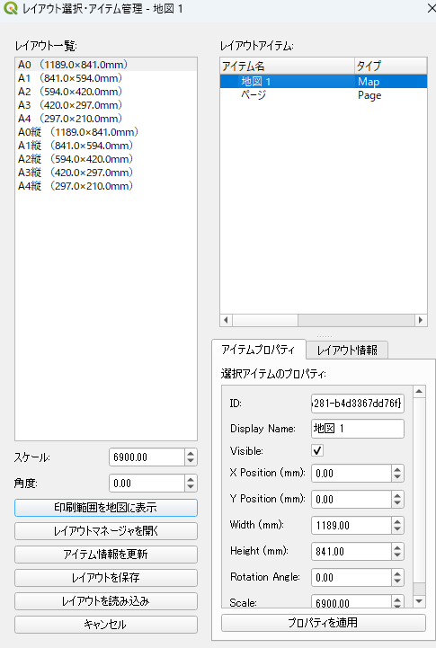

# QGIS Layout Item Selector / レイアウトアイテムセレクター

一つのQGISレイアウトを複数の図面・台帳テンプレートとして活用できる多機能プラグインです。  
This is a multifunctional QGIS plugin that allows you to use a single layout as templates for multiple maps and ledgers.



## 主な機能 / Main Features

- **レイアウト選択・管理 / Layout selection & management**: プロジェクト内の全レイアウトを一覧表示し、選択・管理が可能  
  List and manage all layouts in the project.
- **アイテム一括編集 / Batch item editing**: レイアウト内の全アイテム（地図・ラベル・凡例・画像など）のプロパティ（位置・サイズ・内容・可視性・回転・スケール等）をGUIで編集  
  Edit properties (position, size, content, visibility, rotation, scale, etc.) of all items (map, label, legend, image, etc.) in the layout via GUI.
- **テンプレート保存・一括適用 / Save & apply templates**: レイアウト全体のアイテム構成・プロパティをJSONで保存し、他のレイアウトに一括適用  
  Save the entire layout's item structure/properties as JSON and apply to other layouts in bulk.
- **印刷範囲の地図キャンバス表示 / Show print area on map canvas**: 選択レイアウトの印刷範囲を地図キャンバス上に可視化、スケール・回転・中心座標・角度を調整可能  
  Visualize the print area of the selected layout on the map canvas, and adjust scale, rotation, center, and angle.
- **印刷範囲のマウス移動 / Move print area by mouse**: 印刷範囲（RubberBand）をマウスドラッグで移動し、地図アイテムの範囲も自動更新  
  Move the print area (RubberBand) by mouse drag, and automatically update the map item's extent.
- **多言語対応 / Multilingual support**: 日本語・英語・中国語・韓国語・フランス語・ドイツ語・スペイン語・ポルトガル語・イタリア語・ロシア語のUI自動切替  
  UI automatically switches among Japanese, English, Chinese, Korean, French, German, Spanish, Portuguese, Italian, and Russian.
- **UIメッセージ抑制 / Suppress UI messages**: 通常操作時のメッセージ表示を抑制し、エラーのみ通知  
  Suppresses non-error messages during normal operation; only errors are shown.
- **安定性向上 / Improved stability**: QFormLayout削除対策などでQGISクラッシュを防止  
  Prevents QGIS crashes by handling QFormLayout deletion and other stability improvements.

## 使い方 / Usage

1. プラグインメニューから「Layout Item Selector」を起動  
   Launch "Layout Item Selector" from the plugin menu.
2. レイアウト一覧から編集対象を選択  
   Select the target layout from the list.
3. 左側でスケール・角度・印刷範囲を調整、右側でアイテム一覧・プロパティを編集  
   Adjust scale, angle, and print area on the left; edit item list and properties on the right.
4. 「レイアウト全体を保存」でテンプレートJSONを作成  
   Use "Save Layout" to create a template JSON.
5. 他のレイアウトで「レイアウト全体を読み込み」して一括適用  
   Use "Load Layout" on other layouts to apply the template in bulk.

### 印刷範囲の操作 / Print area operations
- 「Show Print Area on Map」ボタンで印刷範囲を地図キャンバスに表示  
  Show print area on map canvas with the "Show Print Area on Map" button.
- スケール・角度を数値入力で調整  
  Adjust scale and angle by entering values.
- 印刷範囲をマウスでドラッグして移動可能  
  Move the print area by dragging with the mouse.

### アイテム編集 / Item editing
- アイテム一覧から選択し、右側でプロパティ（位置・サイズ・ラベル内容・画像パス等）を編集  
  Select from the item list and edit properties (position, size, label, image path, etc.) on the right.
- 編集後「Apply Properties」で即時反映  
  Click "Apply Properties" to apply changes immediately.

### テンプレート活用 / Template usage
- 既存レイアウトの構成・デザインを他レイアウトに一括適用し、図面・台帳の統一管理が可能  
  Apply the structure/design of an existing layout to others in bulk for unified management.

## 多言語対応 / Multilingual Support

UIはQGISの言語設定に応じて自動で切り替わります。  
The UI automatically switches according to QGIS language settings.

対応言語 / Supported languages:
- 🇯🇵 日本語 (ja) / Japanese
- 🇺🇸 英語 (en) / English
- 🇫🇷 フランス語 (fr) / French
- 🇩🇪 ドイツ語 (de) / German
- 🇪🇸 スペイン語 (es) / Spanish
- 🇮🇹 イタリア語 (it) / Italian
- 🇵🇹 ポルトガル語 (pt) / Portuguese
- 🇨🇳 中国語 (zh) / Chinese
- 🇷🇺 ロシア語 (ru) / Russian
- 🇮🇳 ヒンディー語 (hi) / Hindi

### 翻訳のカスタマイズ / Translation Customization

翻訳を編集・追加する場合：  
To edit or add translations:

1. Qt Linguist で翻訳ファイル (.ts) を編集：  
   Edit translation files (.ts) with Qt Linguist:
   ```
   C:\Qt\linguist_6.9.1\linguist.exe
   ```

2. 翻訳ファイルの場所：  
   Translation files location:
   ```
   geo_report/i18n/geo_report_*.ts
   ```

3. 翻訳後、コンパイルスクリプトを実行：  
   After translation, run the compile script:
   ```bash
   python compile_translations.py
   ```

4. 新しい翻訳文字列を追加した場合：  
   If new translatable strings are added:
   ```bash
   python generate_translations.py
   python add_translations.py
   python compile_translations.py
   ```

## インストール / Installation

1. QGISプラグインマネージャーからインストール、または  
   Install from QGIS Plugin Manager, or
2. このリポジトリをQGISのプラグインディレクトリに配置し有効化  
   Place this repository in the QGIS plugin directory and enable it.

## 活用例 / Use Cases

- **図面テンプレート / Drawing templates**: 同じレイアウト構成で複数地域の図面を効率作成  
  Efficiently create maps for multiple areas with the same layout structure.
- **台帳フォーマット / Ledger formats**: 標準レイアウトの複数案件での再利用  
  Reuse standard layouts for multiple projects.
- **シリーズ地図 / Series maps**: 統一デザインでの主題図作成  
  Create thematic maps with a unified design.
- **タイトル・凡例・注記の一括更新 / Batch update of titles, legends, notes**: 全図面のタイトルや凡例、注記を一括で変更  
  Batch update titles, legends, and notes for all maps.
- **ロゴ・印影配置 / Logo & stamp placement**: 会社ロゴや承認印の位置を全図面で統一  
  Standardize the position of company logos and approval stamps across all maps.
- **スケールバー・グリッド調整 / Scale bar & grid adjustment**: 縮尺やグリッド表示を一括管理  
  Manage scale bars and grid display in bulk.

## バージョン管理 / Versioning

プラグインのバージョンは `metadata.txt` の `version` フィールドで管理されています。  
The plugin version is managed in the `version` field of `metadata.txt`.  
新機能追加や修正時は `metadata.txt` の `version` を更新してください。  
Please update the `version` in `metadata.txt` when adding new features or making fixes.   

## 開発者 / Author

yamamoto-ryuzo

## ライセンス / License

GPL v2.0

## 免責事項

本システムは個人のPCで作成・テストされたものです。  
ご利用によるいかなる損害も責任を負いません。

<p align="center">
  <a href="https://giphy.com/explore/free-gif" target="_blank">
    
  </a>
</p>


## バージョン管理

このプラグインのバージョンは `metadata.txt` の `version` フィールドで管理されています。
新しい機能追加や修正時は `metadata.txt` の `version` を更新してください。
